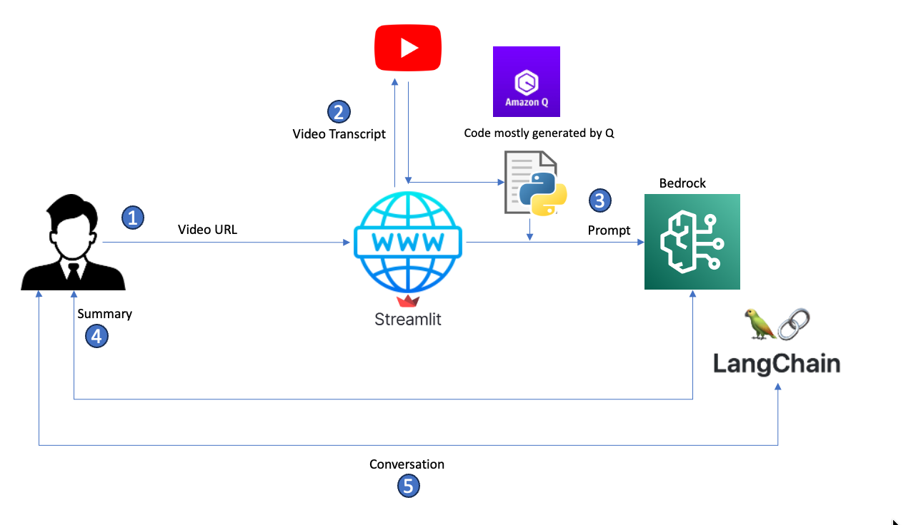

# Video Chatter


This app summarizes Youtube videos and make them conversational 

### The architecture



1. A user enters a YouTube video URL to summarize.
2. The Streamlit app takes the URL, parses it to get the video ID, and calls the YouTube API to get the video transcript.
3. The app builds a prompt from the transcript and passes it to Bedrock for summarization using a predefined model.
4. Bedrock summarizes the transcript based on the generated prompt and returns the summary to the user.
5. If users have follow-up questions, the app builds a conversation memory using Langchain and answers follow-up questions based on content from the original transcript.


### Installation


1. Clone the repo
   ```sh
   git clone git@gitlab.com:subinvs/chatbot.git
   ```
2. Move to root directory
   ```sh
   cd chatbot
   ```
3. Install packages
   ```sh
   pip install -r reuirements.txt
   ```
4. Create .aws folder in the root
5. Move to .aws directory
   ```sh
   cd .aws
   ```
6. Create credentials.ini file and add AWS credentials in the file
   ```sh
   [default]
   aws_access_key_id=<Access key>
   aws_secret_access_key=<Secret access key>
   ```
7. From root folder run the following command to run the application in browser
   ```sh
   streamlit run app.py
   ```
### Security

See [CONTRIBUTING](CONTRIBUTING.md#security-issue-notifications) for more information.

### License

This library is licensed under the MIT-0 License. See the LICENSE file.

